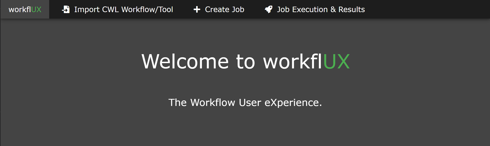
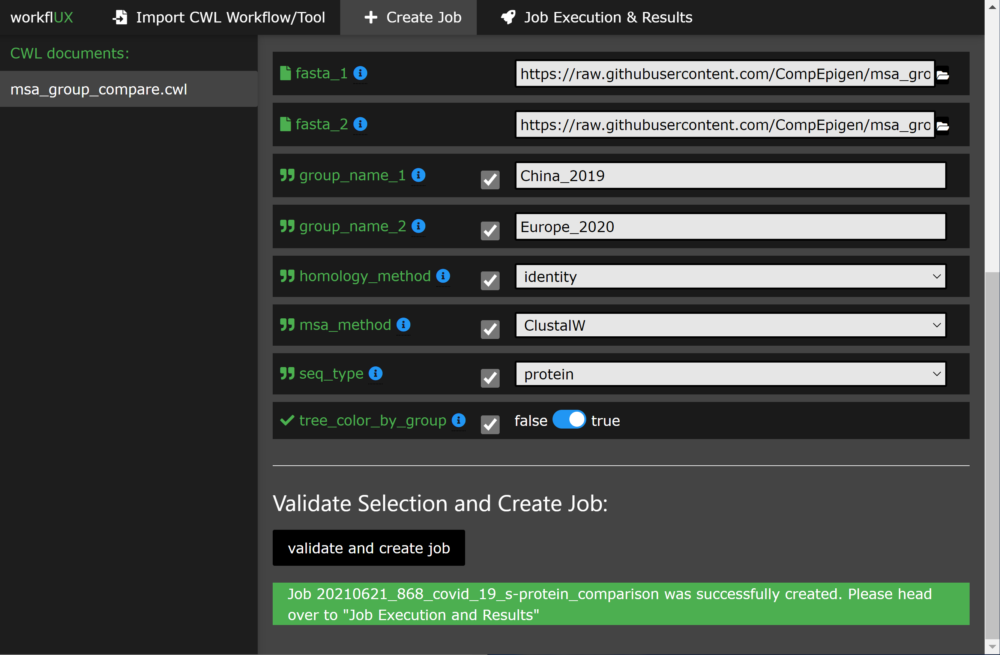

[badges-health-workflux-master]: <https://img.shields.io/website?url=https%3A%2F%2Fcwlab.krini.ingress.rancher.computational.bio%2F>
[depl-ui-workflux-dkfz-master]: <https://cwlab.dev.krini.ingress.rancher.computational.bio/>

# workflUX - The Workflow User eXperience
(Formerly known as CWLab.)

An open-source, cloud-ready web application for simplified deployment of big data workflows.

**CI/CD:**
[](https://dev.azure.com/ComputationalEpigenomics/cwlab/_build/latest?definitionId=2&branchName=master)

**Packaging:**
[](https://pypi.python.org/pypi/workflux/)
[](https://pypi.python.org/pypi/workflux/)
[](https://pypi.python.org/pypi/workflux/)
[](https://hub.docker.com/r/compepigen/workflux/builds)
  
**Citation & Contribution:**
[](https://zenodo.org/badge/latestdoi/180648493)
[](#contributors-)


## Installation and Quick Start:
**Attention: workflUX is in beta state and breaking changes might be introduced in the future. However, if you like to test it or even run in production, we will support you.**

Installation can be done using pip:  
`python3 -m pip install workflux`

Please see the section "Configuration" for a discussion of available options.

Start the webserver with your custom configuration (or leave out the `--config` flag to use the default one):  
`workflux up --config config.yaml`

If you like to make use of containers for dependency management, you need to install [Docker](https://docs.docker.com/install/) or a Docker-compatible containerization solution like [singularity](https://singularity.lbl.gov/) or [udocker](https://github.com/indigo-dc/udocker). To run on Windows or MacOs, please install the dedicated docker versions: [Docker for Windows](https://docs.docker.com/docker-for-windows/), [Docker for Mac](https://docs.docker.com/docker-for-mac/) 

The usage of the web interface should be self-explanatory with build-in instruction. The following section gives an overview of the basic usage scenario.

## Supported Systems:

workflUX is written in platform-agnostic python and can therefore be executed on:  

- **Linux**
- **MacOs**
- **Windows**\*

Any CWL runner that has a command-line interface can be integrated into workflUX in order to execute CWL workflows or tool-wrappers, such as:  

- **cwltool** (the reference implementation) - https://github.com/common-workflow-language/cwltool
- **Toil** (UCSC) - https://github.com/DataBiosphere/toil
- **Cromwell** (Broad Institute) - https://github.com/broadinstitute/cromwell
- **Reana** (CERN) - https://reana.readthedocs.io/en/latest/index.html
- **CWLEXEC** (IBM) - https://github.com/IBMSpectrumComputing/cwlexec
(Please find a constantly updated list at: https://www.commonwl.org/#Implementations)

Therefore, workflUX can be used on any infrastructure supported by these CWL runners, including:  

- **single workstations**
- **HPC clusters** (PBS, LSF, slurm, ...)
- **clouds** (AWS, GCP, Azure, OpenStack)

\***Please Note:**  
Execution on Windows is only supported by cwltool which talks to docker for windows. Therefore, CWL-wrapped tools and workflows which where originally designed for Linux/MacOs can be executed on Windows with a graphical interface provided by workflUX.

## Usage:
Please see our [tutorial](./tutorials/Covid19_MSA_Group_Comparison.md), that walks you through an simple yet meaningful example of how workflUX can be used to compare the spike protein sequences of Covid-19 in two patient cohorts.  

Here are some apetizers:
  
 

## Configuration:
workflUX is a highly versatile package and makes almost no assumptions on your hard- and software environment used for the execution of CWL. To adapt it to your system and use case, a set of configuration options is available:  

- General configs, including: 
    - webserver (hosting IP address and port, remotely or locally available, login protected or not)
    - paths of working directories
- Execution profiles:  
    This flexible API allows you to adapt workflUX to your local software environment and to integrate a CWL runner of your choice (such as Cwltool, Toil, or Cromwell).

All configuration options can be specified in a single YAML file which is provided to workflUX upon start:  
`workflux up --config my_config.yaml`

To get an example config file, run the following command:  
`workflux print_config > config.yaml`
(or see the example below)

### General Configs:

- **WEB_SERVER_HOST**:  
    Specify the host or IP address on which the webserver shall run. Use `localhost` for local usage on your machine only. Use `0.0.0.0` to allow remote accessibility by other machines in the same network.  
    *Default*: `localhost`
- **WEB_SERVER_PORT**:  
    Specify the port used by the webserver.  
    *Default*: 5000

- **TEMP_DIR**:  
    Directory for temporary files.  
    *Default*: a subfolder "workflux/temp" in the home directory
- **WORKFLOW_DIR**:  
    Directory for saving CWL documents.  
    *Default*: a subfolder "workflux/temp" in the home directory
- **EXEC_DIR**:  
    Directory for saving execution data including output files.  
    *Default*: a subfolder "workflux/temp" in the home directory
- **DEFAULT_INPUT_DIR**:  
    Default directory where users can search for input files. You may specify additional input directories using the "**ADD_INPUT_DIRS**" parameter.
    *Default*: a subfolder "workflux/temp" in the home directory
- **DB_DIR**:  
    Directory for databases.  
    *Default*: a subfolder "workflux/temp" in the home directory
- **ADD_INPUT_DIRS**:  
    In addition to "**DEFAULT_INPUT_DIR**", these directories can be searched by the user for input files.  
    Please specify them in the format "*name: path*" like shown in this example:  
    ```
    ADD_INPUT_DIRS:
        GENOMES_DIR: '/ngs_share/genomes'
        PUBLIC_GEO_DATA: '/datasets/public/geo'
    ```
    *Default*: no additional input dirs.
- **ADD_INPUT_AND_UPLOAD_DIRS**:  
    Users can search these directories for input files (in addition to "**DEFAULT_INPUT_DIR**") and they may also upload their one files.  
    Please specify them in the format "*name: path*" like shown in this example:  
    ```
    ADD_INPUT_AND_UPLOAD_DIRS:
        UPLOAD_SCRATCH: '/scratch/upload'
        PERMANEN_UPLOAD_STORE: '/datasets/upload'
    ```
    *Default*: no additional input dirs.

- **DEBUG**:  
    If set to True, the debugging mode is turned on. Do not use on production systems.  
    *Default*: False
    
### Exec Profiles:  
This is where you configure how to execute cwl jobs on your system. A profile consists of four steps: prepare, exec, eval, and finalize (only exec required, the rest is optional). For each step, you can specify commands that are executed in bash or cmd terminal.  

You can define multiple execution profile as shown in the config example below. This allows frontend users to choose between different execution options (e.g. using different CWL runners, different dependency management systems, or even choose a between multiple available batch execution infrastructures like lsf, pbs, ...). For each execution profile, following configuration parameters are available (but only **type** and **exec** is required):  

- **type**:  
    Specify which shell/interpreter to use. For Linux or MacOS use `bash`. For Windows, use `powershell`.  
    *Required*.
- **max_retries**:
    Specify how many times the execution (all steps) is retried before marking a run as failed.
- **timeout**:  
    For each step in the execution profile, you can set a timeout limit.  
    *Default*:  
    ```yaml
    prepare: 120
    exec: 86400
    eval: 120
    finalize: 120
    ```

- **prepare**\*:  
    Commands that are executed before the actual CWL execution. For instance to load required python/conda environments.  
    *Optional*.
- **exec**\*:  
    Commands to start the CWL execution. Usually, this is only the command line to execute the CWL runner. The stdout and stderr of the CWL runner should be redirected to the predefined log file.  
    *Required*.
- **eval**\*:  
    The exit status at the end of the *exec* step is automatically checked. Here you can specify commands to additionally evaluate the content of the execution log to determine if the execution succeeded. To communicate failure to workflUX, set the `SUCCESS` variable to `False`.  
    *Optional*.
- **finalize**\*:
    Commands that are executed after *exec* and *eval*. For instance, this can be used to clean up temporary files.

    
\* **Additional notes regarding execution profile steps:**  

- In each step following predefined variables are available:
    - ``JOB_ID``
    - ``RUN_ID`` (please note: is only unique within a job)
    - ``WORKFLOW`` (the path to the used CWL document)
    - ``RUN_INPUT`` (the path to the YAML file containing input parameters)
    - ``OUTPUT_DIR`` (the path of the run-specific output directory)
    - ``LOG_FILE`` (the path of the log file that should receive the stdout and stderr of CWL runner)
    - ``SUCCESS`` (if set to `False` the run will be marked as failed and terminated)
    - ``PYTHON_PATH`` (the path to the python interpreter used to run workflUX)
- The steps will be executed in the order: prepare, exec, eval, finalize.
- You may define your own variables in one step and access them in the subsequent steps.
- At the end of each step. The exit code is checked. If it is non-zero, the run will be marked as failed. Please note, if a step consists of multiple commands and an intermediate command fails, this will not be recognized by workflUX as long as the final command of the step will succeed. To manually communicate failure to workflUX, please set the `SUCCESS` variable to `False`.
- The steps are executed using pexpect (https://pexpect.readthedocs.io/en/stable/overview.html), this allows you also connect to a remote infrastructure via ssh (recommended to use an ssh key). Please be aware that the path of files or directories specified in the input parameter YAML will not be adapted to the new host. We are working on solutions to achieve an automated path correction and/or upload functionality if the execution host is not the workflUX server host.
- On Windows, please be aware that each code block (contained in ``{...}``) has to be in one line.

### Example configuration files:
  
Below, you can find example configurations for local execution of CWL workflows or tools with cwltool.

#### Linux / MacOs:

```yaml  
WEB_SERVER_HOST: localhost 
WEB_SERVER_PORT: 5000

DEBUG: False  

TEMP_DIR: '/home/workflux_user/workflux/temp'
WORKFLOW_DIR: '/home/workflux_user/workflux/workflows'
EXEC_DIR: '/datasets/processing_out/'
DEFAULT_INPUT_DIR: '/home/workflux_user/workflux/input'
DB_DIR: '/home/workflux_user/workflux/db'

ADD_INPUT_DIRS:
    GENOMES_DIR: '/ngs_share/genomes'
    PUBLIC_GEO_DATA: '/datasets/public/geo'

ADD_INPUT_AND_UPLOAD_DIRS:
    UPLOAD_SCRATCH: '/scratch/upload'
    PERMANEN_UPLOAD_STORE: '/datasets/upload'

EXEC_PROFILES:
    cwltool_local:
        type: bash
        max_retries: 2
        timeout:
            prepare: 120
            exec: 86400
            eval: 120
            finalize: 120
        exec: |
            cwltool --outdir "${OUTPUT_DIR}" "${WORKFLOW}" "${RUN_INPUT}" \
                >> "${LOG_FILE}" 2>&1
        eval: | 
            LAST_LINE=$(tail -n 1 ${LOG_FILE})
            if [[ "${LAST_LINE}" == *"Final process status is success"* ]]
            then
                SUCCESS=True
            else
                SUCCESS=False
                ERR_MESSAGE="cwltool failed - ${LAST_LINE}"
            fi
```

#### Windows:

```yaml
WEB_SERVER_HOST: localhost
WEB_SERVER_PORT: 5000

DEBUG: False  

TEMP_DIR: 'C:\Users\workflux_user\workflux\temp'
WORKFLOW_DIR: 'C:\Users\workflux_user\workflux\workflows'
EXEC_DIR: 'D:\processing_out\'
DEFAULT_INPUT_DIR: 'C:\Users\workflux_user\workflux\input'
DB_DIR: 'C:\Users\workflux_user\workflux\db'

ADD_INPUT_DIRS:
    GENOMES_DIR: 'E:\genomes'
    PUBLIC_GEO_DATA: 'D:\public\geo'
    
ADD_INPUT_AND_UPLOAD_DIRS:
    UPLOAD_SCRATCH: 'E:\upload'
    PERMANEN_UPLOAD_STORE: '\D:\upload'

EXEC_PROFILES:
    cwltool_windows:
        type: powershell
        max_retries: 2
        timeout:
            prepare: 120
            exec: 86400
            eval: 120
            finalize: 120
        exec: |
            . "${PYTHON_PATH}" -m cwltool --debug --default-container ubuntu:16.04 --outdir "${OUTPUT_DIR}" "${CWL}" "${RUN_INPUT}" > "${LOG_FILE}" 2>&1

        eval: |
            $LAST_LINES = (Get-Content -Tail 2 "${LOG_FILE}")

            if ($LAST_LINES.Contains("Final process status is success")){$SUCCESS="True"}
            else {$SUCCESS="False"; $ERR_MESSAGE = "cwltool failed - ${LAST_LINE}"}
```

## Licence:
This package is free to use and modify under the Apache 2.0 Licence.


## Contributors ✨

Thanks goes to these wonderful people ([emoji key](https://allcontributors.org/docs/en/emoji-key)):

<!-- ALL-CONTRIBUTORS-LIST:START - Do not remove or modify this section -->
<!-- prettier-ignore-start -->
<!-- markdownlint-disable -->
<table>
  <tr>
    <td align="center"><a href="https://github.com/KerstenBreuer"><br /><sub><b>Kersten Breuer</b></sub></a><br /><a href="https://github.com/CompEpigen/workflUX/commits?author=KerstenBreuer" title="Code">💻</a> <a href="#design-KerstenBreuer" title="Design">🎨</a></td>
    <td align="center"><a href="https://github.com/lutsik"><br /><sub><b>Pavlo Lutsik</b></sub></a><br /><a href="https://github.com/CompEpigen/workflUX/commits?author=lutsik" title="Code">💻</a> <a href="#ideas-lutsik" title="Ideas, Planning, & Feedback">🤔</a> <a href="#financial-lutsik" title="Financial">💵</a></td>
    <td align="center"><a href="https://github.com/svedziok"><br /><sub><b>Sven Twardziok</b></sub></a><br /><a href="https://github.com/CompEpigen/workflUX/commits?author=svedziok" title="Code">💻</a></td>
    <td align="center"><a href="https://github.com/MariusDieckmann"><br /><sub><b>Marius</b></sub></a><br /><a href="https://github.com/CompEpigen/workflUX/commits?author=MariusDieckmann" title="Code">💻</a> <a href="#infra-MariusDieckmann" title="Infrastructure (Hosting, Build-Tools, etc)">🚇</a></td>
    <td align="center"><a href="https://github.com/lukasjelonek"><br /><sub><b>Lukas Jelonek</b></sub></a><br /><a href="https://github.com/CompEpigen/workflUX/commits?author=lukasjelonek" title="Code">💻</a></td>
    <td align="center"><a href="https://github.com/illusional"><br /><sub><b>Michael Franklin</b></sub></a><br /><a href="https://github.com/CompEpigen/workflUX/commits?author=illusional" title="Code">💻</a></td>
    <td align="center"><a href="https://git.scicore.unibas.ch/kanitz"><br /><sub><b>Alex Kanitz</b></sub></a><br /><a href="https://github.com/CompEpigen/workflUX/commits?author=uniqueg" title="Code">💻</a></td>
  </tr>
  <tr>
    <td align="center"><a href="https://fr.linkedin.com/in/yoannpageaud"><br /><sub><b>Yoann PAGEAUD</b></sub></a><br /><a href="https://github.com/CompEpigen/workflUX/commits?author=YoannPa" title="Code">💻</a></td>
    <td align="center"><a href="https://github.com/yxomo"><br /><sub><b>Yassen Assenov</b></sub></a><br /><a href="#ideas-yxomo" title="Ideas, Planning, & Feedback">🤔</a></td>
    <td align="center"><a href="https://github.com/ifishlin"><br /><sub><b>YuYu Lin</b></sub></a><br /><a href="https://github.com/CompEpigen/workflUX/commits?author=ifishlin" title="Code">💻</a> <a href="#plugin-ifishlin" title="Plugin/utility libraries">🔌</a></td>
  </tr>
</table>

<!-- markdownlint-enable -->
<!-- prettier-ignore-end -->
<!-- ALL-CONTRIBUTORS-LIST:END -->

This project follows the [all-contributors](https://github.com/all-contributors/all-contributors) specification. Contributions of any kind welcome!
