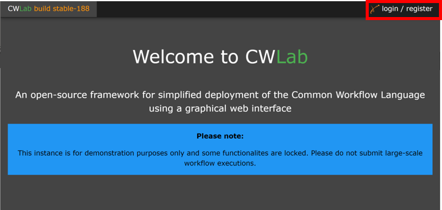
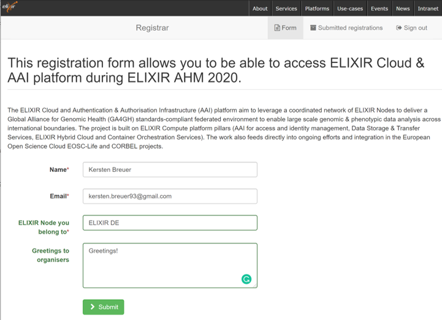

# Comparison of Covid-19 Spike Protein Sequences Using Multiple Sequence Alignment

## Introduction to the Workflow

 

The workflow compares two sets of peptide, DNA, or RNA sequences using following steps:
1. **Multiple sequence alignment** (MSA) and calculate a distance matrix using the Bioconductor’s [msa](http://www.bioconductor.org/packages/release/bioc/html/msa.html) package.
2. Generate and plot a **phylogenetic tree** by neighbor-joining using the packages [ape](https://guangchuangyu.github.io/software/ggtree/documentation/) and [ggtree](https://guangchuangyu.github.io/software/ggtree/documentation/).

There are two required input parameters (fasta_1 and fasta_2) that represent **two sets of sequences** in fasta format. Optional parameters include the sequence type, msa method, and distance type. The workflow’s main output is a plot of a **phylogenetic tree** showing the relation of the two sets.

The workflow can be found at: https://github.com/CompEpigen/msa_group_compare

For further information, please also see: https://w3id.org/cwl/view/git/93d3f03cdd9c44bdc609a11f097a4bad9451be84/CWL/workflows/msa_group_compare.cwl 

## Aim of the Demo:

Using the above workflow, we would like to investigate whether there has been a change in the sequence of **COVID19 surface glycoprotein** between the early outbreak in China and the subsequent **wave in Europe**.

Therefore we will compare sequences from two patient cohorts:

* **China**, until the end of **2019, 11 patients**
* **Europe**, in January **2020, 10 patients**

Source: NCBI Virus (04/06/2020),
https://www.ncbi.nlm.nih.gov/labs/virus/vssi/#/

> **Please Note**: The workflow and its application presented here are intended for demonstration purposes only. We do not claim that this analysis and the produced result represent best scientific practice. 

## **Step 1: Register with Your ELIXIR Account**

	1.1. Connect to CWLab using your browser of choice: https://cwlab.krini.ingress.rancher.computational.bio/

You should see a welcome screen like this:

 

	1.2. Press on ***login / register*** in the top bar.

>    You will be forwarded to ELIXIR AAI.

 

ELIXIR AAI will ask you to register your account to be part of a specific group.

	1.3. Please fill in the registration form and submit.

>  

Upon successful registration, you should see a message like this:

 

	1.4. Please press continue to be redirected to CWLab.

## **Step 2: Login with Your ELIXIR Account** 

 

Now that you have registered, you may log in.

	2.1. Please press the login / register button again.

  You will be forwarded to ELIXIR AAI.
 

